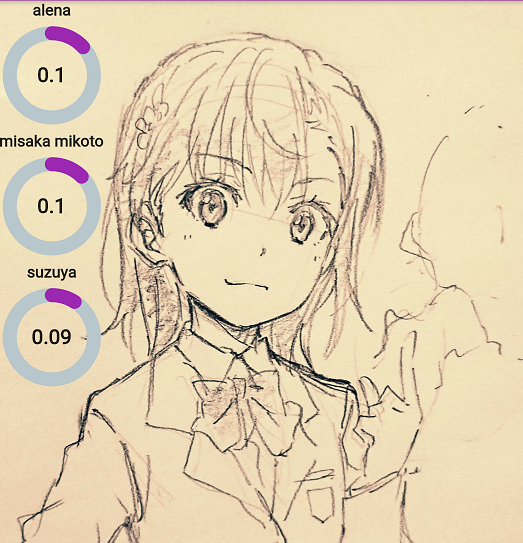
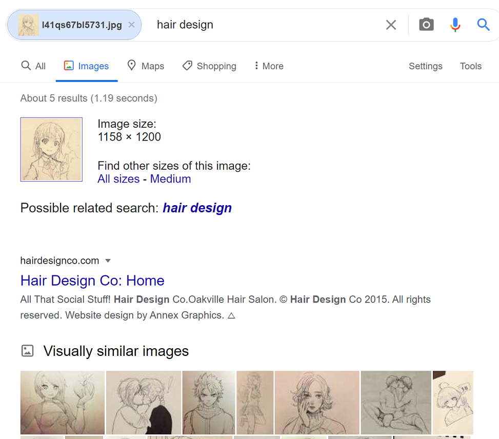
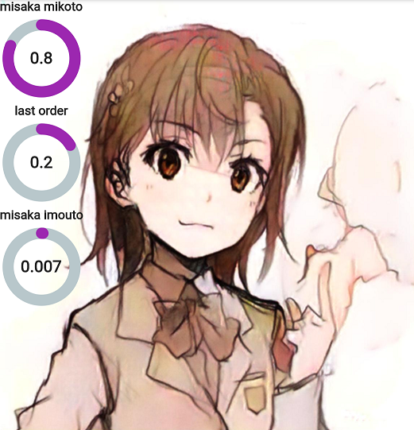
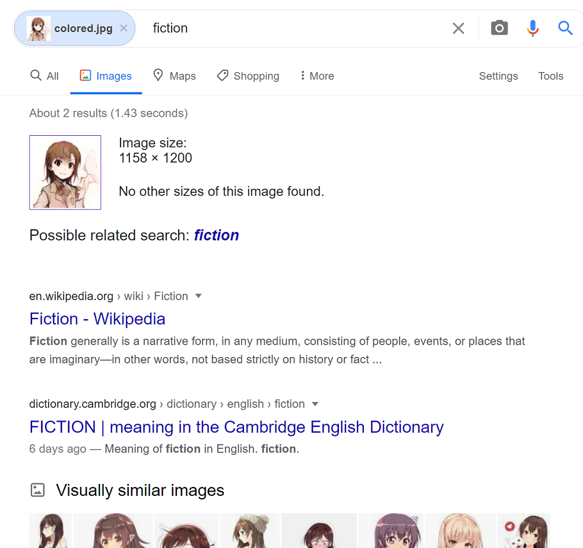

# Crystal Eyes

"Crystal Eyes" is an anime character recognition system powered by machine learning.

It can currently recognize [*1551* 2D characters](chara.json) with the top-3 accuracy of 0.860 and the top-5 accuracy of 0.892, which to our knowledge is the first system that can recognize more than *1500* 2D characters with high performance using machine learning.

> Crystal Eyes are special eyes that can see the difference in colors of the spirits.
> -- Magicians in the future

[Buy Me A Coffee! :coffee:](https://www.buymeacoffee.com/KiyoshiMu)

## Usage

### Deploy

We strongly recommend using Docker to play with this system.

#### Option 1. Docker

    docker pull kiyoshimu/crystal_eyes:latest

    docker run --publish 8080:8080 --name ce --detach kiyoshimu/crystal_eyes
#### Option 2. localhost
    pip install -qU crystal-eyes

    git clone https://github.com/KiyoshiMu/Crystal-Eyes

    cd Crystal-Eyes

    wget --no-check-certificate 'https://docs.google.com/uc?export=download&id=1tHFH0TfKLY4J4QY53vsRxQ8hvjTWqk2E' -O models.tar

    tar -xvf models.tar

    uvicorn app:app --port 8080

### Test

You can go to http://localhost:8080/docs#/default/dectect_dectect__post to try the API on the browser.

Or you can do the following:

(Make sure you clone the Repo and cd into its folder.)

    python fetch.py

You should see

    {"preds":[[["rem_(re:zero)",0.9321731925010681],["diamond_(houseki_no_kuni)",0.009175019338726997],["hatsune_miku",0.005332328844815493]]],"head_locs":[[[436,17],[748,329]]]}

### Use

A python template that reads an image from the local filesystem is as following. Remember, the *file* is bytes, and the *respond* is plain text.

```python
search_url = "http://127.0.0.1:8080/dectect/?topN=3"

def fetch():
    files = {"file": open("data/test0.jpg", "rb")}
    res = requests.post(search_url, files=files)
    print(res.text)
```

## Benchmark
### Advantage

To our knowledge, Crystal Eyes is the first system that can recognize more than *1500* 2D characters with high performance using machine learning. Other methods, like [Moeflow](https://freedomofkeima.com/moeflow/) only support 100 characters with an accuracy of 70% (unknown whether it is top-N or first-1-precision).

This system's advantage is that it doesn't rely on indexing, making it lightweight and agile, which means it can recognize **unseen images**.

An example would be someone's original line sketch.

(Source: https://twitter.com/DELF_001/status/1144293924950777857)

Crystal Eyes's result


Google Image's result


Or colored sketch (a GAN model made the colors)

Crystal Eyes's result


Google Image's result


### Drawback

1. The design is first to detect the head. If the head cannot be detected correctly, the downstream process will be severely undermined. Also, if an input is a character's face, which has less information than the head, the encoder and classifier's performance will deteriorate.

2. If more characters need to be recognized, the system needs to re-train the classifier. (It's not a big deal, though).
## Development
### Mechanisms

Put it simply, the pathway is "Image -> Head -> Embedding -> Name&Probability"

Three models assist the overall process: a YOLOv5 for head detection, an encoder for generating an embedding from the head, and a classier mapping the embedding to a class.

More details may be written down as a paper if possible.
